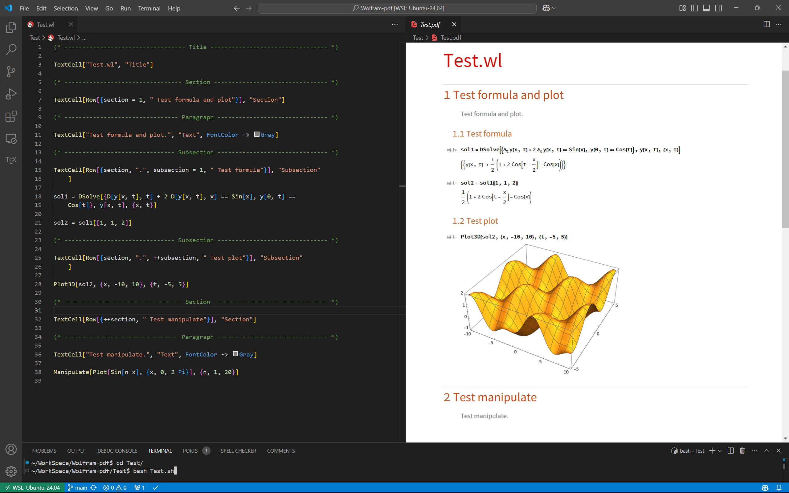

# Convert WolframScript to PDF

## Usage
```shell
wolframscript -f /path/to/WolframPDF.wls "/path/to/file.wls"
```



## Link
[Mathematica Stack Exchange](https://mathematica.stackexchange.com/questions/293543/converting-wolfram-language-scripts-wls-into-pdfs)